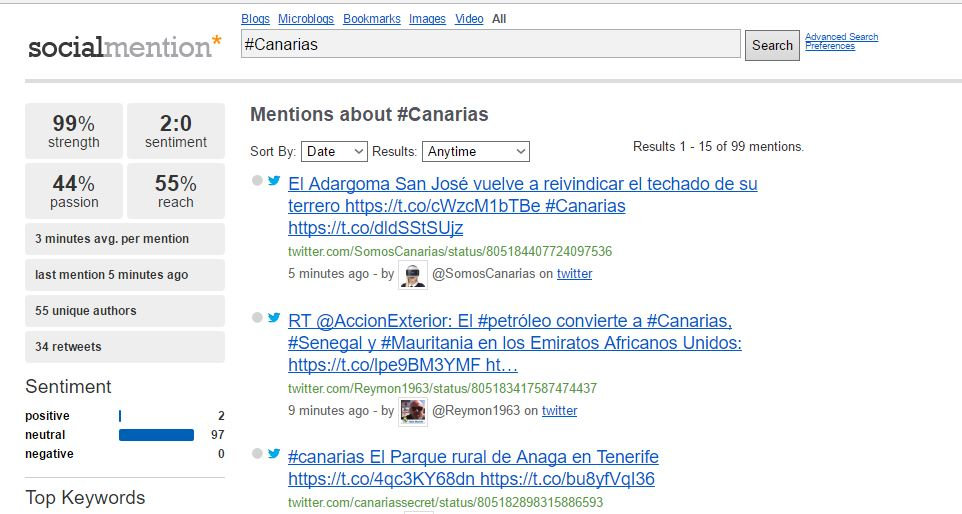

# *TrabajoFinalTio16Grupo1*

## Miembros
+ Constanza Polette Leon Baritussio
+ Edna Liliana Galiano Camacho
+ Kevin Estévez Expósito
+ Pablo Sebastián Caballero
+ Andrea Rodríguez Rivarés
+ Yeray Pérez Peraza

### Definir la problemática a desarrollar

Disponemos de una o varias cuentas de twwiter relacionadas con educación las cuales debemos estudiar para
saber que tráfico tienen, que usuarios interactúan o simplemente análisis la repercusión y la actividad que se
desarrolla en dicha o dichas cuentas.

### Indicar el nombre propuesto para su proyecto.

**Análisis del impacto de twitter en la educación de canarias**

### Herramienta a usar

Los miembros del grupo hemos realizado una encuesta (formulario de Google), para elegir la herramienta que deseamos 
usar para el proyecto. 

La herramienta más votada es [SocialMention](http://www.socialmention.com "SocialMention"), la cual usaremos 
una serie de hashtags para buscar la información relacionada con la educación. Para ello introduciremos el hastag en la barra de búsqueda y luego obtenemos los datos o relevancia de dicho hashtag, para luego realizar el estudio. 

El funcionamiento de la herramientas consiste en nuestro caso en introducir el hastag que deseamos analizar para obtener la repercusión que tiene dicho hastag, las menciones que tiene, los usuarios que lo usan. 

El uso de la herramienta consiste en buscar en twitter el hastag que queremos ver la trascendencia que tiene y el uso que se le ha dado y ya con el hastag la herramienta nos muestra la información relevante.

#### Captura de como se usaría la herramienta

###Propuesta tecnológica concreta a desarrollar.

###Fuentes de datos principales.

La fuente principal de nuestros datos va a ser Twitter 

### Procesamiento de estos datos y transformaciones.

### Resultados esperados. 
 Los resultados que se esperan conseguir con el análisis de distintas cuentas de la red social Twitter son:
+ Número de tweets realizados.
+ Conocer la repercusión, difusión y contenido visual que tiene un tweet.
+ Hashtags más utilizados o los temas de más tendencia.
+ Número de seguidores y clasificación de los mismos.
+ Conexión entre usuarios.
+ Obtener un gráfico con el número de impresiones orgánicas que hayan alcanzado nuestros tweets, en otras palabtas, número de veces que se han mostrado un determinado mensaje.
+ Tasa de interacción, clicks que han obtenido un enlace en concreto.
+ Número de retweets.
+ Número de tweets marcados como varitos.
+ Respuestas recibidas a mensajes.

### Diagrama Gantt del desarrollo del proyecto.

### Propuesta de modelo de negocio para el desarrollo.

### Creación de un repositorio de contenidos con los aportes del proyecto.

[Repositorio](https://github.com/alu0100783612/PrabajoFinalTio16Grupo1 "Enlace al ropositorio en github")
