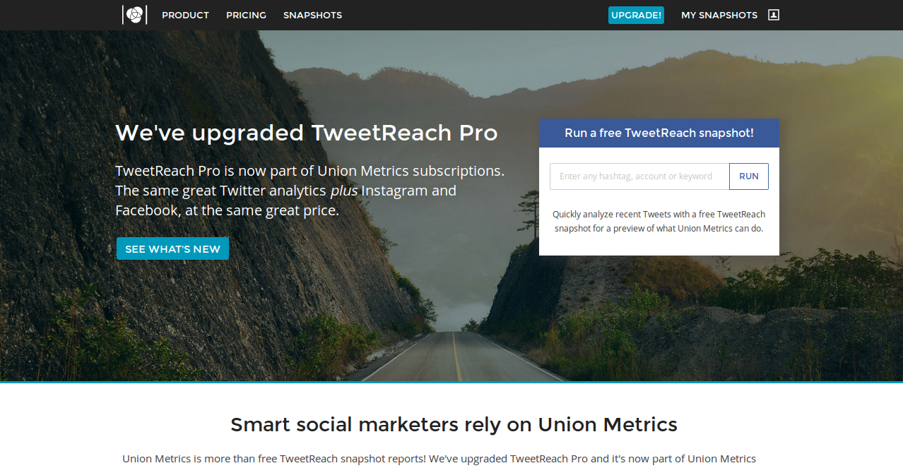
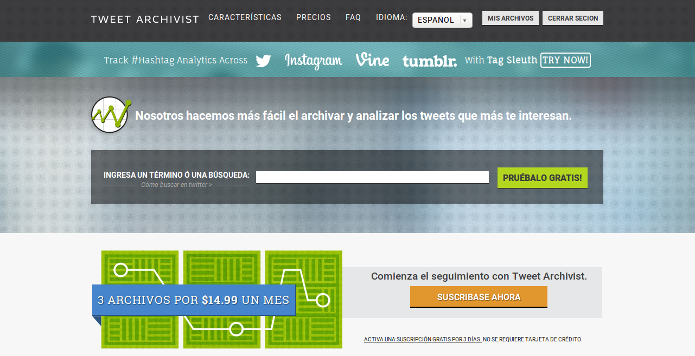
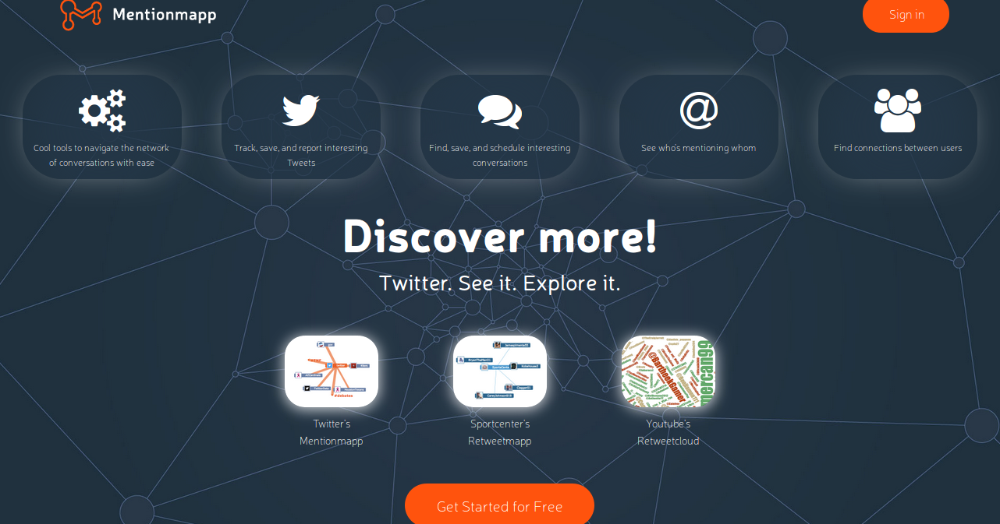
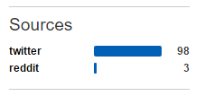
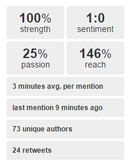
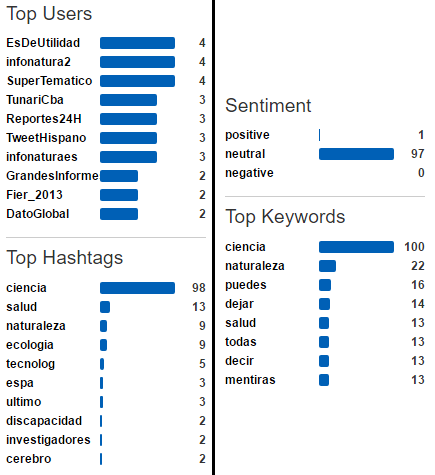
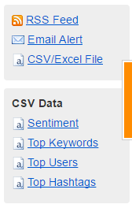
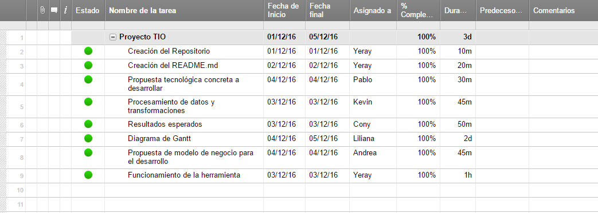
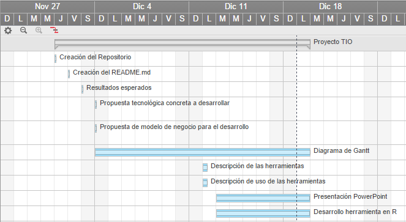

# *TrabajoFinalTio16Grupo1*

## Miembros
+ Constanza Polette León Baritussio
+ Edna Liliana Galiano Camacho
+ Kevin Estévez Expósito
+ Pablo Sebastián Caballero
+ Andrea Rodríguez Rivarés
+ Yeray Pérez Peraza

### Definir la problemática a desarrollar

Disponemos de una o varias cuentas de twwiter relacionadas con educación las cuales debemos estudiar para
saber que tráfico tienen, que usuarios interactúan o simplemente análisis la repercusión y la actividad que se
desarrolla en dicha o dichas cuentas.

### Indicar el nombre propuesto para su proyecto.

**Análisis del impacto de twitter en la educación Seattle, WA**

## Cambio de Herramienta 

Hemos pasado de utilizar una unica herramienta (SocialMention) a trabajar con otras tres, debido a que éstas nos permiten realizar un analisis más detallados
otorgando, de esta forma, un mayor volumen de datos.

Las tres herramienta que mencionábamos anteriomente son las siguientes : TweetReach, TweetArchivist y Mentionmapp. Las dos primeras serán utilizadas para obtener
los ficheros de datos, mientras que la ultima generará los graficos.

## Descripción de cada Herramienta

Tweet Reach:  es una herramienta de análisis de Twitter que nos permite averiguar información acerca de los Tweets publicados. Creada por Union Metrics en 
San Francisco (Estados Unidos), mide principalmente, el alcance de los últimos 50 tweets publicados. Ésta herramienta permite realizar análisis e informes con los datos
más relevantes, para poder mejorar el contenido en los futuros tweets que publiques, monitorizar tu cuenta en tiempo real para permitirte actuar en todo momento,
visualizar todos los mensajes en tiempo real y realizar un seguimiento de los hashtags o palabras clave de Twitter, entre más opciones.

Tweet Archivist: esta herramienta analiza los últimos tuits de su cuenta para crear estadísticas y gráficos. Dentro de los datos que nos aporta ésta herramienta
nos encontramos con el alcance estimado, impresiones de los tuits con los hashtags, los usuarios más influyentes que han utilizado el hashtag, los tuits más retuiteados, 
participantes en el hashtag (usuarios que lo han utilizado, número de tuits de cada uno, RT’s conseguidos e impresiones) y timeline de los tuits.

Mentionmapp: Se trata de una herramienta que viene fenomenal para ver las conexiones entre usuarios. Nos genera un mapa interactivo que nos viene perfecto para monitorizar 
el seguimiento de los usuarios, temas, menciones, hashtags, etc., y generar un informe completo. Podemos ir modificando este mapa moviendo cada uno de los objetos y 
dándoles la importancia que queremos en referencia al número de menciones, hashtags, etc. De un simple vistazo y de forma muy visual, podemos ver con qué usuarios interactuamos más, las menciones que nos hacen y ver los tuits más importantes y que más repercusión han tenido.

### Propuesta tecnológica concreta a desarrollar.

Se desarrollará una aplicación en el lenguaje R que tendrá como objetivo obtener diversas estadísticas como el número de tweets, palabras claves, usuarios relacionados,etc, a través de hashtags y usuarios que tengan relación con el ámbito de la educación en la red social Twitter. 

Para ello, se utilizarán herramientas de apoyo para analizar Twitter y obtener los  datos que necesitamos para su posterior análisis en R.

Las herramientas que utilizaremos son:

-Tweet Reach permite obtener un análisis del alcance de los tweets.

-Mentionmapp es una web que nos permite obtener un grafo que refleja las relaciones principales de un usuario de Twitter con otros usuarios y hashtags más utilizados. Se usará para mostrar la información de manera más visual.

-Twitter Archivist se utilizará para analizar hashtags y así obtener los últimos tweets que usaron ese hashtag. Estos datos se exportarán a un archivo CSV para su análisis en R.

### Fuentes de datos principales.

La fuente principal de nuestros datos va a ser Twitter, tras una reunión del grupo, hemos decidido  a priori usar la cuenta de Edudemic(@Edudemic), la cual tiene un gran volumen de datos relacionados con la educación y la tecnología

### Procesamiento de estos datos y transformaciones.

Una vez introducido el hashtag en la herramienta [SocialMention](http://www.socialmention.com "SocialMention"), queremos mostrar únicamente los resultados relacionados con Twitter, por lo que debemos ir a la parte inferior izquierda de la pantalla y seleccionar la red social:

Ahora que tenemos los datos filtrados por la red social Twitter, podemos ver los tuits relacionados con el hashtag introducido. Además, la herramienta nos muestra datos útiles como la fuerza del hashtag, la media de tiempo transcurrido entre menciones del hashtag, o el número de autores que lo han usado:

También se nos muestra el tipo de opinión de los tuits que contienen el hashtag, palabras clave, usuarios que han tuiteado con el hashtag, y otros hashtags relacionados con el que se ha buscado:

Además, SocialMention nos permite descargar los datos obtenidos en formato CSV por si queremos realizar alguna otra transformación o tatamiento de los datos:

### Resultados esperados. 
 Los resultados que se esperan conseguir con el análisis de distintas cuentas de la red social Twitter son:
+ Número de tweets realizados.
+ Conocer la repercusión, difusión y contenido visual que tiene un tweet.
+ Hashtags más utilizados o los temas de más tendencia.
+ Número de seguidores y clasificación de los mismos.
+ Conexión entre usuarios.
+ Obtener un gráfico con el número de impresiones orgánicas que hayan alcanzado nuestros tweets, en otras palabtas, número de veces que se han mostrado un determinado mensaje.
+ Tasa de interacción, clicks que han obtenido un enlace en concreto.
+ Número de retweets.
+ Número de tweets marcados como varitos.
+ Respuestas recibidas a mensajes.

### Diagrama Gantt del desarrollo del proyecto.

#### · Tabla de contenido

#### · Diagrama de Gantt

### Propuesta de modelo de negocio para el desarrollo.
En cuanto a la importancia de las aplicaciones seleccionadas  en la sociedad actual, nuestras herramientas podrían servir para monitorear a las empresas competentes, investigar la importancia de una marca, un evento o un asunto en concreto.

Como también dos de las herramientas seleccionadas muestran los datos de forma gráfica, servirían para realizar presentaciones y mostrar los datos de una forma más visual y entendible para alguien que no tenga conocimientos en métricas.

Por último, la herramienta que no muestra los datos gráficamente lo hace mediante ficheros CSV, por lo que se pueden realizar todo tipo de transformaciones con dichos ficheros, como, por ejemplo, utilizar herramientas como Carto o RStudio para realizar un tratamiento de datos más técnico.

### Creación de un repositorio de contenidos con los aportes del proyecto.

[Repositorio](https://github.com/alu0100783612/PrabajoFinalTio16Grupo1 "Enlace al ropositorio en github")
