# *TrabajoFinalTio16Grupo1*

## Miembros
+ Constanza Polette León Baritussio
+ Edna Liliana Galiano Camacho
+ Kevin Estévez Expósito
+ Pablo Sebastián Caballero
+ Andrea Rodríguez Rivarés
+ Yeray Pérez Peraza

### Definir la problemática a desarrollar

Disponemos de una o varias cuentas de twwiter relacionadas con educación las cuales debemos estudiar para
saber que tráfico tienen, que usuarios interactúan o simplemente análisis la repercusión y la actividad que se
desarrolla en dicha o dichas cuentas.

### Indicar el nombre propuesto para su proyecto.

**Análisis del impacto de twitter en la educación Seattle, WA**

## Cambio de Herramienta 

Hemos pasado de utilizar una unica herramienta (SocialMention) a trabajar con otras tres, debido a que éstas nos permiten realizar un analisis más detallado,
otorgando de esta forma, un mayor volumen de datos.

Las tres herramienta que mencionábamos anteriomente son las siguientes : TweetReach, TweetArchivist y Mentionmapp. Las dos primeras serán utilizadas para obtener
los ficheros de datos, mientras que la ultima generará los graficos.

## Descripción de cada Herramienta

###Tweet Reach : 

Es una herramienta de análisis de Twitter que nos permite averiguar información acerca de los Tweets publicados. Creada por Union Metrics en 
San Francisco (Estados Unidos), mide principalmente, el alcance de los últimos 50 tweets publicados. Ésta herramienta permite realizar análisis e informes con los datos
más relevantes, para poder mejorar el contenido en los futuros tweets que publiques, monitorizar tu cuenta en tiempo real para permitirte actuar en todo momento,
visualizar todos los mensajes en tiempo real y realizar un seguimiento de los hashtags o palabras clave de Twitter, entre más opciones.

###Tweet Archivist : 

Ésta herramienta analiza los últimos tuits de su cuenta para crear estadísticas y gráficos. Dentro de los datos que nos aporta,
nos encontramos con el alcance estimado, impresiones de los tuits con los hashtags, los usuarios más influyentes que han utilizado el hashtag, los tuits más retuiteados, 
participantes en el hashtag (usuarios que lo han utilizado, número de tuits de cada uno, RT’s conseguidos e impresiones) y timeline de los tuits.

###Mentionmapp : 

Se trata de una herramienta que viene fenomenal para ver las conexiones entre usuarios. Nos genera un mapa que nos premite monitorizar 
el seguimiento de los usuarios, temas, menciones, hashtags, etc., y generar un informe completo. Podemos ir modificando este mapa moviendo cada uno de los objetos y 
dándoles la importancia que queremos en referencia al número de menciones, hashtags, etc. De un simple vistazo y de forma muy visual, podemos ver con qué usuarios interactuamos más, las menciones que nos hacen y ver los tuits más importantes y que más repercusión han tenido.

### Propuesta tecnológica concreta a desarrollar.

Se desarrollará una aplicación en el lenguaje R que tendrá como objetivo obtener diversas estadísticas como el número de tweets, palabras claves, usuarios relacionados,etc, a través de hashtags y usuarios que tengan relación con el ámbito de la educación en la red social Twitter. 

Para ello, se utilizarán herramientas de apoyo para analizar Twitter y obtener los  datos que necesitamos para su posterior análisis en R.

Las herramientas que utilizaremos son:

-Tweet Reach permite obtener un análisis del alcance de los tweets.

-Mentionmapp es una web que nos permite obtener un grafo que refleja las relaciones principales de un usuario de Twitter con otros usuarios y hashtags más utilizados. Se usará para mostrar la información de manera más visual.

-Twitter Archivist se utilizará para analizar hashtags y así obtener los últimos tweets que usaron ese hashtag. Estos datos se exportarán a un archivo CSV para su análisis en R.

### Fuentes de datos principales.

La fuente principal de nuestros datos va a ser Twitter, tras una reunión del grupo, hemos decidido  a priori usar la cuenta de Edudemic(@Edudemic), la cual tiene un gran volumen de datos relacionados con la educación y la tecnología

### Procesamiento de estos datos y transformaciones.

###Tweet Reach :

Una vez entramos en la plataforma, introducimos el hashtag que queremos analizar en el cuadro de búsqueda:

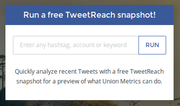

Ahora que se nos muestran los datos obtenidos de la red social Twitter, podemos ver los tuits relacionados con el hashtag introducido, así como el alcance estimado, o el la exposición de dicho hashtag. Cabe destacar que, al ser la versión de prueba, solo se nos mostrarán los datos de unos pocos tuits:

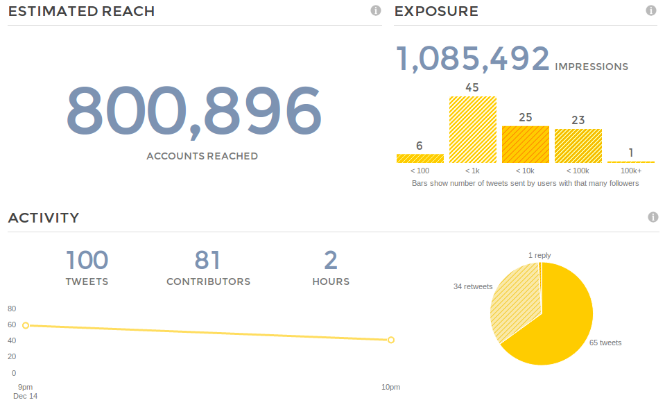

Además, de forma gratuita podemos descargar el fichero con los datos en diferentes formatos por si queremos realizar alguna otra transformación o tatamiento de los datos:

###Tweet Archivist :

Una vez entramos en la plataforma, introducimos el hashtag que queremos analizar en el cuadro de búsqueda:

Ahora que se nos muestran los datos obtenidos de la red social Twitter, podemos ver los tuits relacionados con el hashtag introducido, así como el número de éstos, las impresiones o el rango de fechas sobre las que se está mostrando los datos:

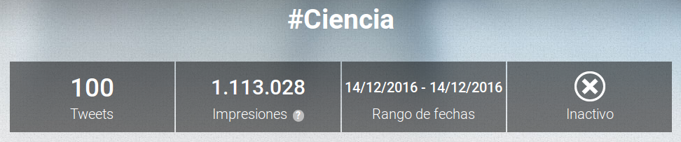

Además, se nos mustra algún gráfico simple con los usuarios con mayor uso del hashtag:

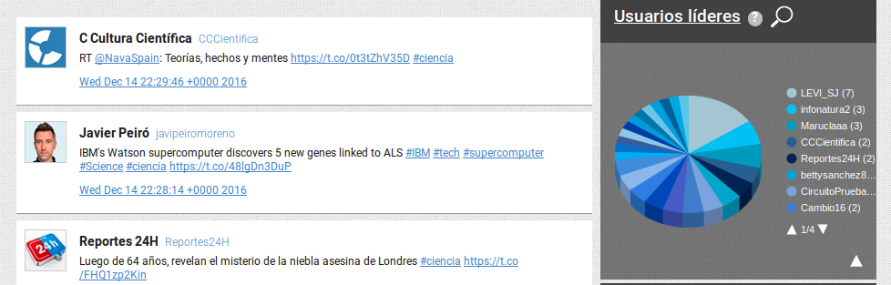

Cabe destacar que para poder descargar los ficheros con los datos se debe registrar en versión de prueba.

###Mentionmapp :

Una vez entramos en la plataforma, clickamos en el botón "Get Started for Free" y nos logueamos con nuestra cuenta de twitter. De esta forma nos aparecerá el cuadro de búsqueda en el que podemos introducir un hashtag:

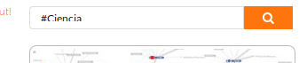

Así, se nos mostrará un grafo a modo de mapa en el que se puede identificar, de forma bastante visual las cuentas de usuarios con mayor cantidad de tuits realizados, etc:

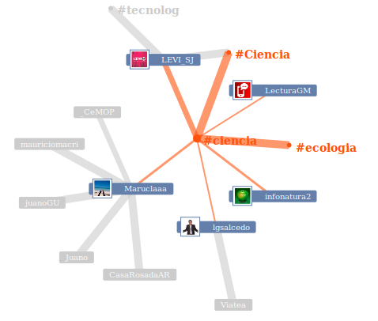

Además, la herramienta nos permite descargar el mapa en formato PNG.

### Resultados esperados. 
 Los resultados que se esperan conseguir con el análisis de distintas cuentas de la red social Twitter son:
+ Número de tweets realizados.
+ Conocer la repercusión, difusión y contenido visual que tiene un tweet.
+ Hashtags más utilizados o los temas de más tendencia.
+ Número de seguidores y clasificación de los mismos.
+ Conexión entre usuarios.
+ Obtener un gráfico con el número de impresiones orgánicas que hayan alcanzado nuestros tweets, en otras palabtas, número de veces que se han mostrado un determinado mensaje.
+ Tasa de interacción, clicks que han obtenido un enlace en concreto.
+ Número de retweets.
+ Número de tweets marcados como varitos.
+ Respuestas recibidas a mensajes.

### Diagrama Gantt del desarrollo del proyecto.

#### · Tabla de contenido

#### · Diagrama de Gantt

### Propuesta de modelo de negocio para el desarrollo.
En cuanto a la importancia de las aplicaciones seleccionadas  en la sociedad actual, nuestras herramientas podrían servir para monitorear a las empresas competentes, investigar la importancia de una marca, un evento o un asunto en concreto.

Como también dos de las herramientas seleccionadas muestran los datos de forma gráfica, servirían para realizar presentaciones y mostrar los datos de una forma más visual y entendible para alguien que no tenga conocimientos en métricas.

Por último, la herramienta que no muestra los datos gráficamente lo hace mediante ficheros CSV, por lo que se pueden realizar todo tipo de transformaciones con dichos ficheros, como, por ejemplo, utilizar herramientas como Carto o RStudio para realizar un tratamiento de datos más técnico.

### Programación en lenguaje R
+ Librerías utilizadas

 - library("RODBC")
 - library("gdata")
 - library("tm")
 - library("wordcloud")

+ Importación de los datos 
Para la importación de los datos, se ha realizado un merge con los ficheros obtenidos de las herramientas(Tweet Reach y Tweet Archivist), para ello hemos contado con la ayuda de Excel. Donde hemos podido tipificar  cada campo del fichero y con la  función para exportar documentos separados por tabuladores, se han obtenido los datos de tal forma que desde el lenguaje R, hemos podido crear un data.frame con los datos a trabajar.

+ Carga de los datos
	~~~
 datos = read.table("C:/R/datos1.txt")
 ~~~
+ Extracción de la información
Al cargar los datos los introducimos dentro de un “data.frame”, puesto que trabajamos con distintos tipos de datos, numéricos y strings, como definimos en el documento antes de la importación a nuestro entorno de programación. 
Como trabajamos con data.frame podemos acceder a la información de dos formas:

 - datos$v1 hasta datos$v7, accedemos a los datos que forman cada columna del data frame
 - datos[,1] hasta datos[,7] como si se tratara de una matriz donde elegimos los vectores en columnas.
 
Así podemos acceder a los datos.
 
 + Representación de los datos
 
 + Histograma de menciones
Para medir las menciones que tienen los tweets analizados hemos considera que la mejor forma es la creación de un histograma de     frecuencias con el cual podemos ver a simple vista y de una forma intuitiva la frecuencia con la que se hacen las menciones de los tweets. 
  
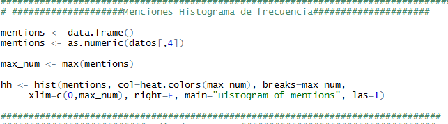
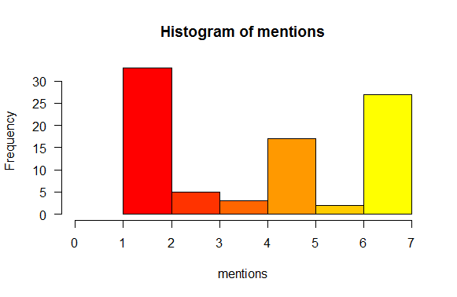

+ Media de retweets

Un buen indicador de la popularidad de la cuenta es el número de retweets, por lo que sí sabemos la media de los mismos podemos hacernos una idea aproximada de la influencia de la cuenta en la comunidad de Twitter
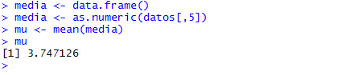

+ Usuarios con más tweets

Para analizar qué usuarios tienen más tweets hemos creído oportuno realizar una nube de palabras con los usuarios que más se repiten, para tal fin hemos creado un corpus con los datos de los usuarios, con la librera “TM”  hemos analizado las concurrencias y con tal información hemos creado la siguiente nube de los usuarios que más se repite.

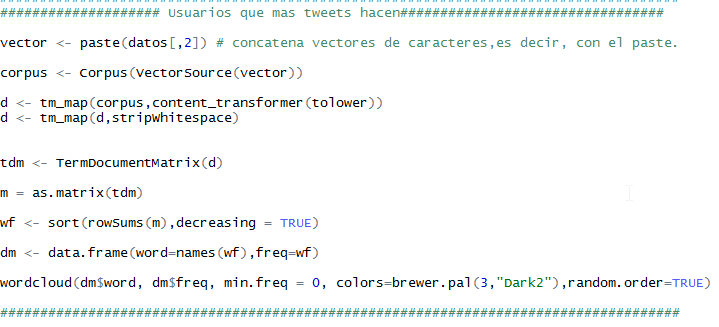

Como podemos observar y debido al poco volumen de datos, sólo concurre un usuario cada vez si dispondremos de mayores valores la gráfica tendría más información o volumen de concurrencias. 	

+ Nube de puntos tweets vs retweets

El último estudio que hemos realizado consta de enfrentar en una gráfica el número de tweets y el número de retweets con el fin de poder comprobar si un tweets es muchas veces retuiteado, con esta gráfica la idea es poder analizar que tiene más influencia si los tweets o los retuit, es decir, sabemos si en esta cuenta se aporta información o se comparte o retuitea más información 

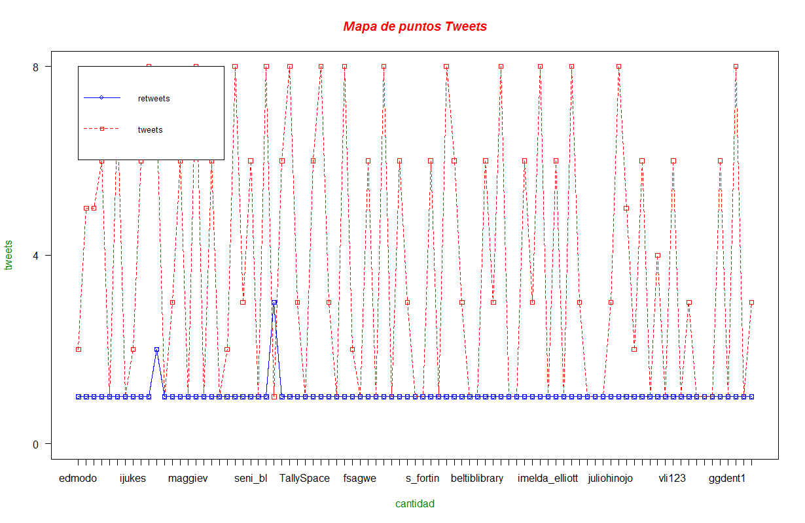

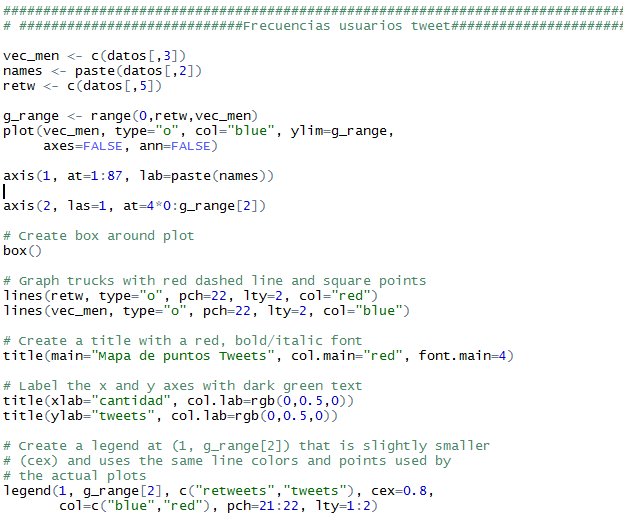

### Creación de un repositorio de contenidos con los aportes del proyecto.

[Repositorio](https://github.com/alu0100783612/PrabajoFinalTio16Grupo1 "Enlace al ropositorio en github")
