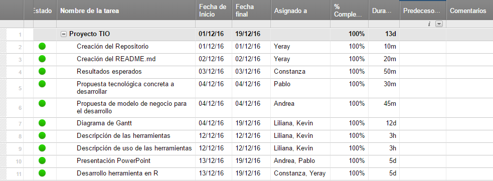

# *TrabajoFinalTio16Grupo1*

## Miembros
+ Constanza Polette Leon Baritussio
+ Edna Liliana Galiano Camacho
+ Kevin Estévez Expósito
+ Pablo Sebastián Caballero
+ Andrea Rodríguez Rivarés
+ Yeray Pérez Peraza

### Definir la problemática a desarrollar

Disponemos de una o varias cuentas de twwiter relacionadas con educación las cuales debemos estudiar para
saber que tráfico tienen, que usuarios interactúan o simplemente análisis la repercusión y la actividad que se
desarrolla en dicha o dichas cuentas.

### Indicar el nombre propuesto para su proyecto.

**Análisis del impacto de twitter en la educación de canarias**

### Herramienta a usar

Los miembros del grupo hemos realizado una encuesta (formulario de Google), para elegir la herramienta que deseamos 
usar para el proyecto. 

La herramienta más votada es [SocialMention](http://www.socialmention.com "SocialMention"), la cual usaremos 
una serie de hashtags para buscar la información relacionada con la educación. Para ello introduciremos el hastag en la barra de búsqueda y luego obtenemos los datos o relevancia de dicho hashtag, para luego realizar el estudio. 

El funcionamiento de la herramientas consiste en nuestro caso en introducir el hastag que deseamos analizar para obtener la repercusión que tiene dicho hastag, las menciones que tiene, los usuarios que lo usan. 

El uso de la herramienta consiste en buscar en twitter el hastag que queremos ver la trascendencia que tiene y el uso que se le ha dado y ya con el hastag la herramienta nos muestra la información relevante.

#### Captura de como se usaría la herramienta

### Propuesta tecnológica concreta a desarrollar.

Se desarrollará una aplicación en el lenguaje R que tendrá como objetivo analizar el número de tweets, palabras claves, usuarios relacionados y hashtags, que tengan relación con el ámbito de la educación en Canarias en la red social Twitter. Para conseguirlo, se hará uso del análisis semántico latente.

Los datos con los que trabajaremos se conseguirán a través de la página web Socialmention que nos permitirá obtener información de Twitter en tiempo real a través de un buscador en el que se introduce el hashtag para obtener todos los datos asociados a dicho hashtag y poder descargarlo en un fichero CSV para su posterior análisis.

### Fuentes de datos principales.

La fuente principal de nuestros datos va a ser Twitter 

### Procesamiento de estos datos y transformaciones.

Una vez introducido el hashtag en la herramienta [SocialMention](http://www.socialmention.com "SocialMention"), queremos mostrar únicamente los resultados relacionados con Twitter, por lo que debemos ir a la parte inferior izquierda de la pantalla y seleccionar la red social:

Ahora que tenemos los datos filtrados por la red social Twitter, podemos ver los tuits relacionados con el hashtag introducido. Además, la herramienta nos muestra datos útiles como la fuerza del hashtag, la media de tiempo transcurrido entre menciones del hashtag, o el número de autores que lo han usado:

También se nos muestra el tipo de opinión de los tuits que contienen el hashtag, palabras clave, usuarios que han tuiteado con el hashtag, y otros hashtags relacionados con el que se ha buscado:

Además, SocialMention nos permite descargar los datos obtenidos en formato CSV por si queremos realizar alguna otra transformación o tatamiento de los datos:

### Resultados esperados. 
 Los resultados que se esperan conseguir con el análisis de distintas cuentas de la red social Twitter son:
+ Número de tweets realizados.
+ Conocer la repercusión, difusión y contenido visual que tiene un tweet.
+ Hashtags más utilizados o los temas de más tendencia.
+ Número de seguidores y clasificación de los mismos.
+ Conexión entre usuarios.
+ Obtener un gráfico con el número de impresiones orgánicas que hayan alcanzado nuestros tweets, en otras palabtas, número de veces que se han mostrado un determinado mensaje.
+ Tasa de interacción, clicks que han obtenido un enlace en concreto.
+ Número de retweets.
+ Número de tweets marcados como varitos.
+ Respuestas recibidas a mensajes.

### Diagrama Gantt del desarrollo del proyecto.

#### · Tabla de contenido

#### · Diagrama de Gantt

### Propuesta de modelo de negocio para el desarrollo.
Nuestra aplicación web, SocialMention, sirve para buscar y analizar todos los contenidos, comentarios, fotos, videos, hashtags, etc. compartidos por los usuarios en Internet. Nos permite saber quién menciona nuestra marca, en qué red social, blog... y en qué momento.

En cuanto a su importancia en las empresas, podría servir para monitorear la influencia de una marca, un evento o un asunto en concreto. También serviría para monitorear la influencia de la competencia. Todo esto no serviría si posteriormente no realizamos un análisis de la información recopilada con la herramienta, ya que a parte de dar porcentajes, gráficas y datos, también proporciona las páginas, blogs... donde se menciona dicha información.

Es muy importante especificar el canal por el que se trasladará la herramienta a los clientes, en nuestro caso, se podrá acceder a la herramienta a través de Internet. Es necesario tener una conexión a Internet para poder usarla. Funciona en todos los dispositivos: ordenador, tablet, móvil, etc., por lo que es muy útil en el caso de necesitar hacer una búsqueda rápida.

Por último, SocialMention tiene una opción en la que se pueden escribir propuestas de mejoras para la aplicación, con ella se puede establecer una relación un poco más directa con las personas que se encargan de su desarrollo o de darle soporte. Funciona de este modo: escribes la propuesta, le pones un pequeño título con el cual describir la propuesta y lo envías (para poder enviar dicha propuesta se debe iniciar sesión en gmail o Facebook).

### Creación de un repositorio de contenidos con los aportes del proyecto.

[Repositorio](https://github.com/alu0100783612/PrabajoFinalTio16Grupo1 "Enlace al ropositorio en github")
